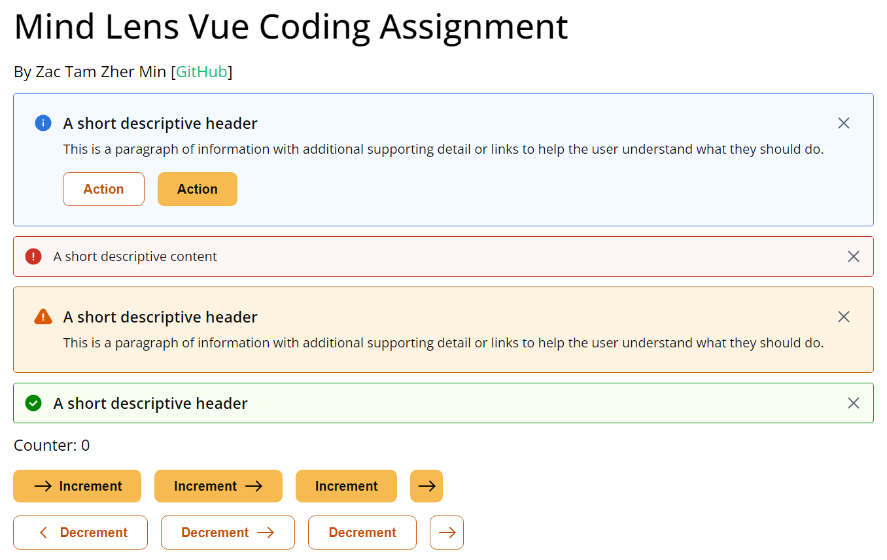

# Mind Lens Vue Assignment

This project uses [pnpm](https://pnpm.io/) as the package manager. You can install it using `npm`.

```bash
npm install -g pnpm
pnpm install
pnpm run dev
```

## Work preview



## The assignment [[PDF Doc]](./Mind%20Lens%20Short%20coding%20test.pdf)

Mind Lens coding assignment for front-end developer.

[Figma Doc](https://www.figma.com/file/UUOLHjqN8SbU3rhxRBchGk/Coding-test?node-id=2%3A8132&t=lYkfKyoLf7ho2I00-1)

Goal of this assignment is to create reusable components that can be created, published,
verified, used and maintained.

- All tasks must be completed using Vue 3 framework.
- Evaluation will be based on completion, the effectiveness of the code, and pixel perfection in comparison to Figma.

## Create a button component

Create a button component that will be shared as one of the components in the design system.
The button should be easy to use as a component, it should be able to switch states and
variations.

Below are the properties and variations for the button:
| Property              | Variation                                                                        |
| --------------------- | -------------------------------------------------------------------------------- |
| Content variations    | Left icon & text, right icon & text, text only, icon only                        |
| Button types          | Primary button, Secondary button                                                 |
| Button states         | Default, hover, clicked, disabled                                                |
| Spacing               | Vertical padding 6px, Horizontal padding 12px, Spacing between text and icon 4px |
| Icon size             | 24px X 24px                                                                      |
| Fonts                 | Open sans, 16px, semi-bold                                                       |
| Button colour & style | Follow the Figma file provided                                                   |

## Create an alerts & notifications component

Create an alerts & notifications component that will be shared as one of the components in the
design system.

The alerts & notifications component should be easy to use as a component, switch states and
variations.

Demonstrate how the component can be responsive.

Below are the properties and variations for the button:
| Property           | Variation                                                                                |
| ------------------ | ---------------------------------------------------------------------------------------- |
| Content variations | 1. Icon & header 2. Icon, header and subtext 3. Icon, header, subtext and call to action |
| Types              | Error, Warning, Success, Information                                                     |
| Spacing and styles | Follow Figma file provided                                                               |

## Publish component

Publish the component so that you can use them to create a sample app.

## Use published component

Write a sample app to demonstrate that the components that we created above can be used in other applications.

## Testing

Propose effective methods to test

- Unit tests: Vitest or Jest or Cypress + Vue Test Utils
- Coded components that are the same as Figma: Percy or BackstopJS
- Coded components are the same as components used in other apps: Percy or BackstopJS
- Coded component stays the same even when changes are made to other components during further releases (visual regression): Percy or BackstopJS
